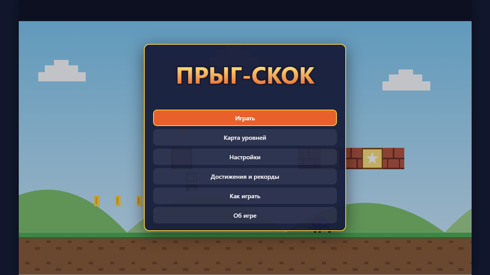
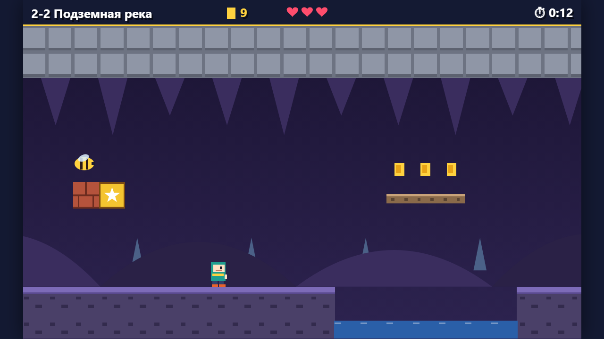
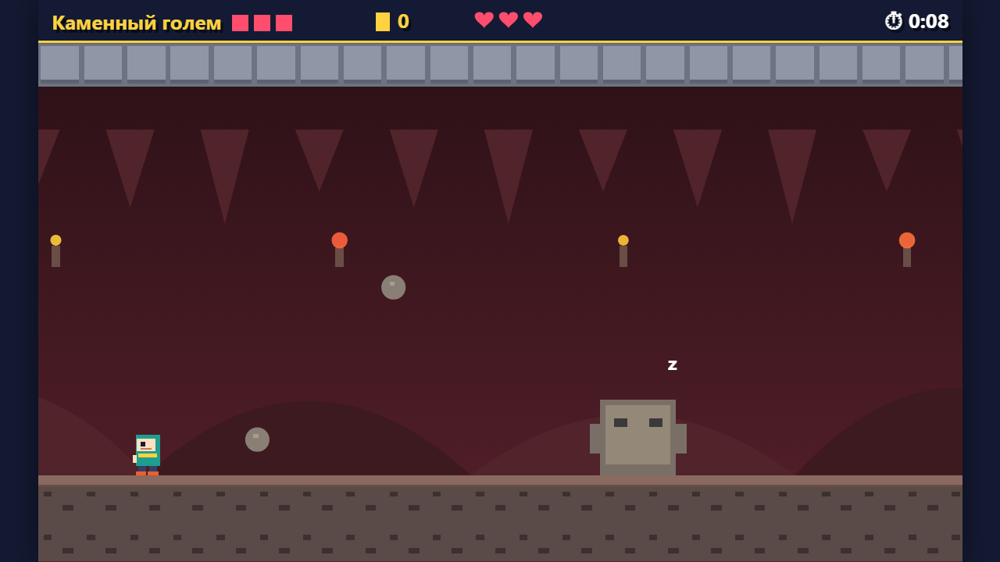

# Jump Jump

**English** · [Русский](README.ru.md)

**Jump Jump** («Прыг-скок») is a platformer in a single HTML page with its own hero, bugs, bees and two bosses. It runs in the browser with no server and no internet: open `index.html` or play it online.

**[▶ Play online](https://alexalesha.github.io/JumpJump/)**

> Fan-made game, not affiliated with any rights holder. The hero, enemies, blocks and bosses are original and drawn by code.

The interface is in Russian.







## What is in the game

- **Two worlds of four levels:** Sunny Valley and the Dungeons; the fourth level of each world is a boss lair.
- Flags in the middle of a level are checkpoints. Stars per level: finish it, collect all coins (also from gift blocks), beat the time.
- Jump on bugs and bees from above, hit gift blocks from below; the orange spring throws you high; spikes and pits are dangerous.
- Bosses: the Bug King (jump on its head) and the Stone Golem (hit it only while it rests with the spikes hidden).
- A level map, achievements and records, settings, gamepad support; music and sounds are synthesised with WebAudio.

## Controls

| Key | Action |
|---|---|
| ← → or A / D | walk |
| Shift or X | run |
| Space or ↑ | jump (hold to jump higher) |
| Esc | pause |

Keys can be changed in the settings where the game offers it; a gamepad works too where noted above.

## Run locally

Open `index.html` in Chrome, Edge or Firefox. Everything is in the repository; nothing is downloaded.

## Tests

The laws are Playwright tests in `tests/`. They open the page by its file address in headless
Chromium, one at a time:

```
npm install
npx playwright install chromium
npm test
```

Mouse capture in the tests is always a stub (a real `requestPointerLock` in headless Chromium on
Windows can clip the user's cursor).
The pictures above were made headless by the screenshot script of the GameRoom collection.

## History

The game was made in the [GameRoom](https://github.com/ALEXalesha/GameRoom) collection, where it also runs in the Igroteka launcher ([play there](https://alexalesha.github.io/GameRoom/)). This repository carries the game with its commit history.

## Licence

MIT, see [LICENSE](LICENSE).
